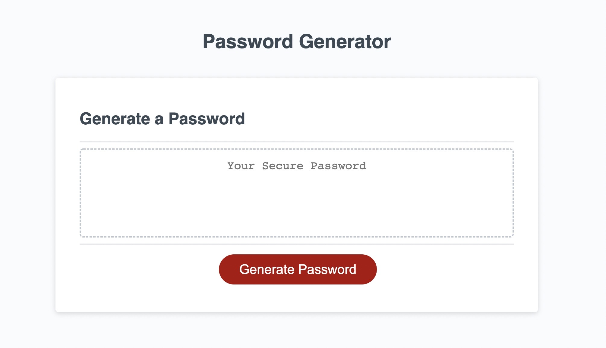
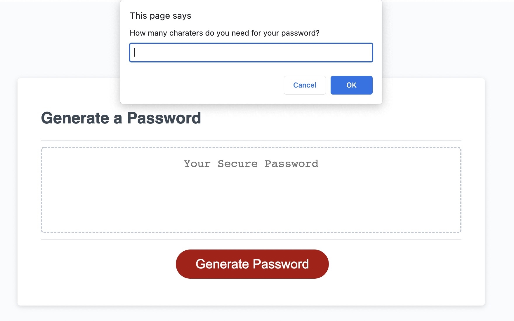

# Create Password

This website creates password incorporating several user inputs.

## Links to the webpage and repository

To access the website use [Create Password](https://haruka08.github.io/password-creater/)
To access the GitHub repository use [GitHub Repository Create-Passord](https://github.com/Haruka08/password-creater) 

## Content

There will be a series of prompts upon clicking on the Generate Password buttom to request user input on the following list of criteria.

1.  Length of the password
2.  Whether to include uppercase letters
3.  Whether to include lowercase letters
4.  Whether to include numbers
5.  Whether to include special letters [i.e. %, $, !, etc.]

## Screenshot of the modified website

